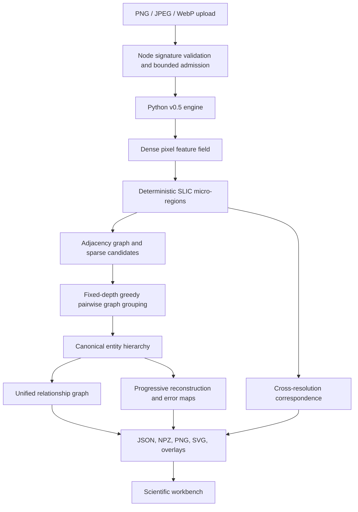

# v0.5 Processing Architecture

The browser does not execute computer vision. Node validates canonical base64 plus MIME, extension, and binary signature agreement; applies process-local admission limits; creates an isolated temporary workspace; invokes the Python entry point with a timeout; uploads completed artifacts; and keeps the representation available for typed inspector queries.

The Python system is divided into schema/configuration, dense features, canonical geometry and sufficient statistics, segmentation, graph construction, fixed-depth grouping, correspondence, reconstruction, and orchestration modules. This preserves the server interface while allowing later experimental strategies to replace one module at a time without overstating the current grouping algorithm.
