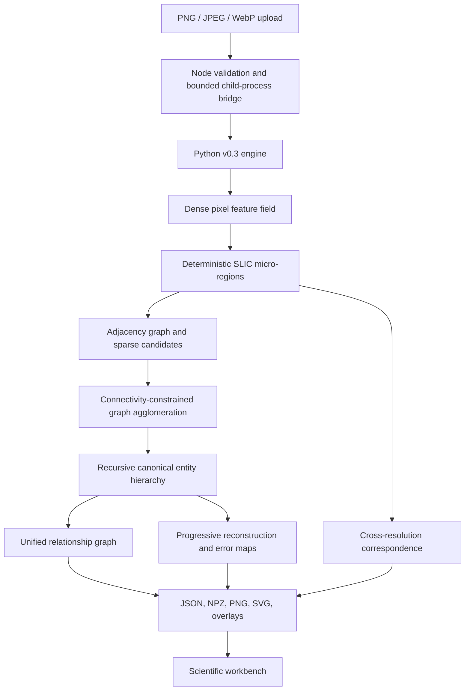

# v0.3 Processing Architecture

The browser does not execute computer vision. Node validates the input, creates an isolated temporary workspace, invokes the Python entry point with a timeout, uploads completed artifacts, and keeps the representation available for typed inspector queries.

The Python system is divided into schema/configuration, dense features, canonical geometry and sufficient statistics, segmentation, graph construction, hierarchy agglomeration, correspondence, reconstruction, and orchestration modules. This preserves the server interface while allowing later experimental strategies to replace one module at a time.
