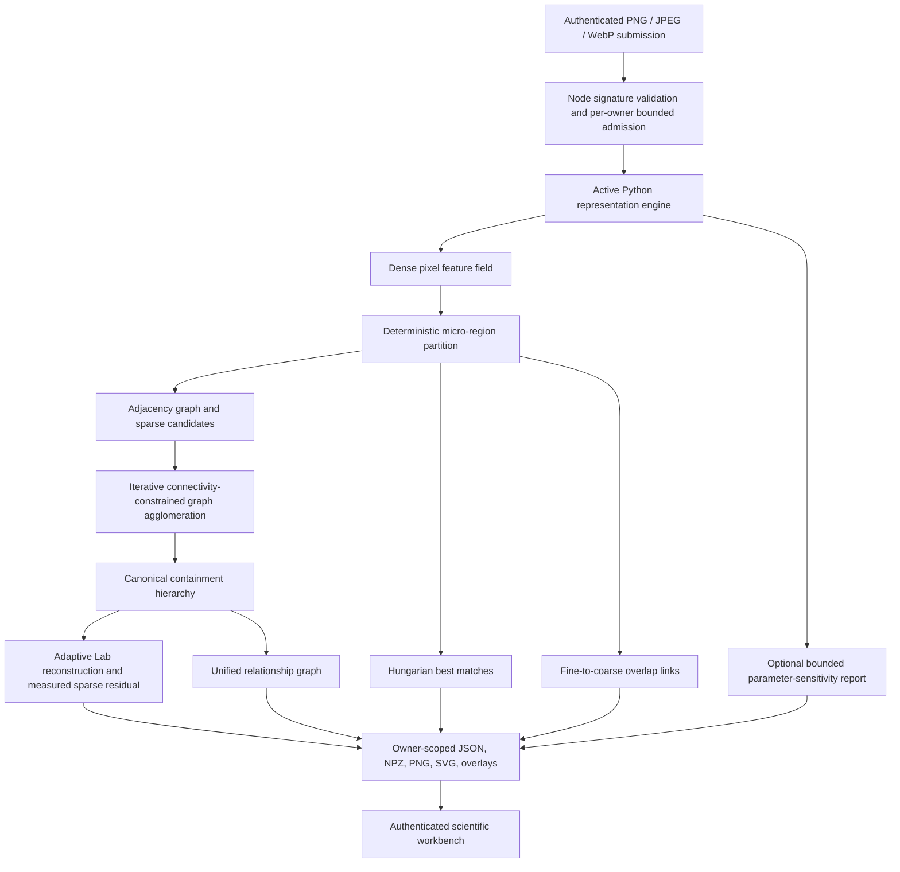

# v0.6 Processing Architecture

The browser is an inspection and control layer; it does not execute computer vision. Node requires authentication for analysis creation and result inspection, validates canonical base64 plus MIME, extension, and binary-signature agreement, applies process-local per-owner admission limits, creates a temporary workspace, invokes `python_engine/representation_engine.py` with a timeout, uploads the emitted artifacts, and keeps result metadata only in an owner-scoped bounded cache.

The active Python path combines versioned configuration, dense feature extraction, canonical geometry and sufficient statistics, deterministic segmentation, sparse graph construction, iterative local graph recomputation after each accepted merge, separate cross-scale best-match and overlap evidence, adaptive reconstruction, measured sparse residual encoding, sensitivity evidence, and orchestration. Historical entry points are compatibility shims or archived reference code rather than alternative active engines.
