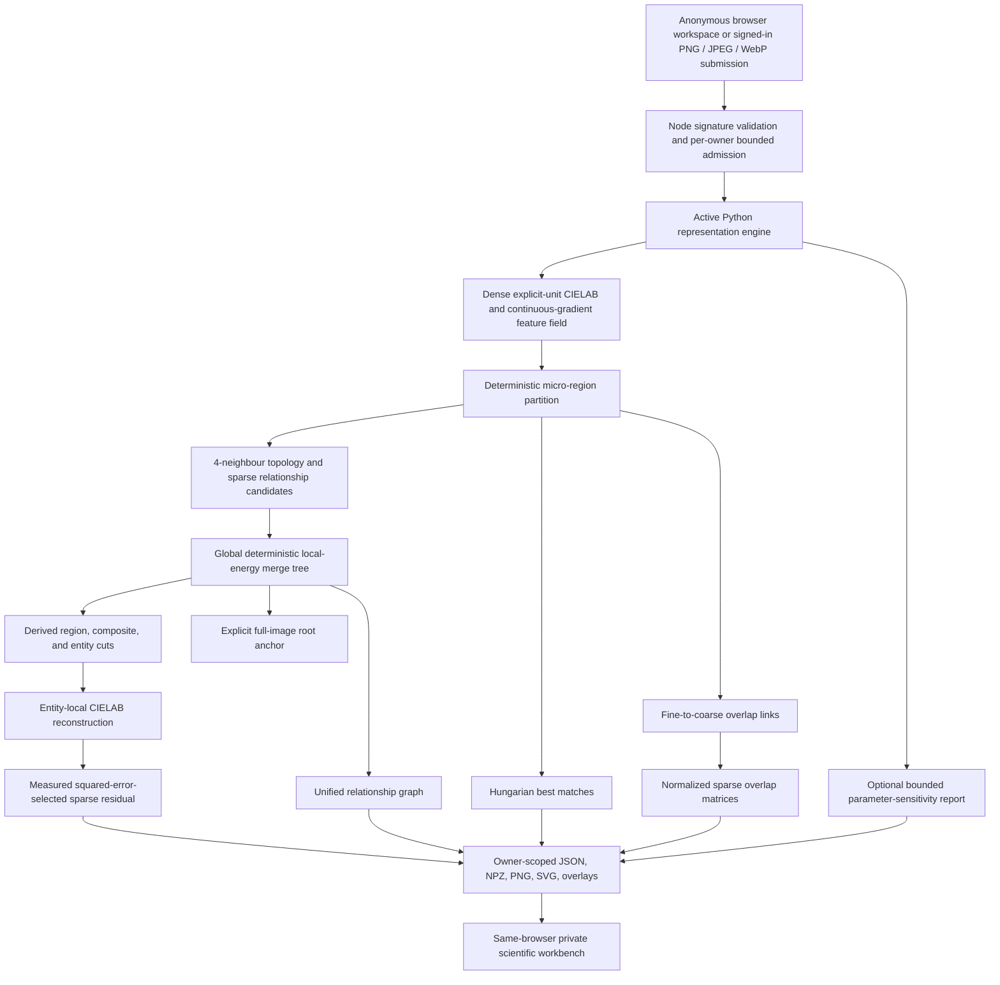

# v0.7 Processing Architecture

The browser is an inspection and control layer; it does not execute computer vision. Signed-in users retain their account owner key, while a normal no-login run receives an opaque HttpOnly browser-workspace cookie. Node validates canonical base64 plus MIME, extension, and binary-signature agreement, applies bounded per-owner admission limits, creates a temporary workspace, invokes `python_engine/representation_engine.py` with a total timeout and a no-progress watchdog, uploads emitted artifacts, and persists a durable owner-scoped manifest in addition to the bounded process-local cache. A normal job starts with a 120-second process allowance. During active `merge_tree` work only, recent rate-limited heartbeats can earn fixed 30-second extensions up to a finite five-minute normal ceiling; this covers public CPU-scheduling variance without reducing analysis fidelity or granting an unbounded request. An explicit, capped sensitivity study retains its separate finite workload-aware budget and forwards each nested deterministic variant’s stage event as a visible `sensitivity` heartbeat. The manifest’s private progress snapshot carries the current stage, coalesced stage-timing entries with bounded de-duplicated public-safe messages, bounded extension totals, and a bounded advanced-only ETA range across process instances. The factual server percentage and the client-only ETA-range visualization remain separate. Admission, Python start, stage progress, finalization, terminal outcome, and logical access revocation emit privacy-safe logs keyed only by opaque job IDs.

Result issuance always passes through the manifest access guard. On expiry or deliberate discard, the service clears result/evidence caches and removes the durable payload **and timing snapshot**, then returns `NOT_FOUND` for status, result, artifact, entity, hierarchy, relationship, exact ΔRGB, and thresholded-heatmap issuance. A completed private payload embeds an `AnalysisExecutionTiming@1` timeline with server-observed orchestration durations and bounded stage message records; it contains no source pixels, artifact URLs, or diagnostic stderr. The workbench lazy-loads this result-only timeline module, and the production build separates stable framework/data/UI/icon vendor chunks from the main first-use workbench entry. This is **access-only revocation**; the managed storage adapter does not expose a supported physical-delete operation, so the architecture does not assert immediate deletion of underlying platform object bytes.

During global energy-tree construction, the Python worker emits rate-limited `merge_tree` heartbeats while evaluating relationships and scoring candidate merges. The bridge treats those normalized public-safe stage events as liveness activity. At a normal-budget boundary, the bridge grants an extension only when the current stage is `merge_tree` and a heartbeat arrived within the configured freshness window; it never extends other stages, stale heartbeats, advanced studies, or a job already at its normal ceiling. The separate 45-second true-silence watchdog remains authoritative. A genuinely silent child is still stopped by the bounded watchdog, and its terminal failure names the last safe stage rather than incorrectly implying that active deterministic hierarchy work has stalled.

Before importing the heavy engine modules, the CLI emits a flushed `initializing_engine` heartbeat. The bridge grants this bootstrap state a separately bounded cold-start grace window that cannot exceed the active total process budget; after the first ordinary engine-stage event, the normal no-progress watchdog applies again. Terminal workbench states display elapsed duration through their persisted terminal timestamp rather than continuing to count after completion, failure, cancellation, or expiry.

Each owner-scoped terminal failure may also carry a bounded `AnalysisFailure@1` receipt. It records only the failure category, last safe stage, elapsed duration, child/startup readiness booleans, and an opaque current-browser diagnostic token. The receipt never includes source pixels, image content, raw stderr, environment values, storage URLs, or stack traces. Child timeout, spawn error, cancellation, close, and malformed-completion paths share one settlement boundary, and terminal job states refuse later stale completion/failure overwrites.

The representative seven-fixture benchmark suite completed across geometric, gradient, illustration, logo-like, and pixel-oriented inputs. It found no new deterministic-engine regression after lifecycle hardening; variability remains primarily data-dependent in merge acceptance, relationship count, artifact size, and residual coverage rather than a uniform analysis-stage stall.

The active Python path combines versioned configuration, dense CIELAB feature extraction, continuous gradient boundary evidence, 4-neighbour canonical geometry, child sufficient-statistics aggregation, deterministic segmentation, sparse graph construction, a global energy-scored merge tree, deterministic cut derivation, separate cross-scale best-match and overlap evidence, entity-local adaptive reconstruction, measured sparse residual selection, sensitivity evidence, and orchestration. Historical entry points are compatibility shims or archived reference code rather than alternative active engines.

| Component | Responsibility | Key v0.7 guarantee |
|---|---|---|
| `features.py` | Builds dense pixel vectors | CIELAB units are explicit; edge strength is continuous gradient evidence |
| `geometry.py` | Computes masks, geometry, vectors, and sufficient statistics | Parents aggregate child statistics while union masks define canonical geometry |
| `hierarchy.py` | Maintains global merge candidates and derives cuts | Stable local energy ordering; no claim of global-partition optimality |
| `correspondence.py` | Produces best matches, overlap links, and sparse overlap matrices | Cross-scale evidence is never represented as hierarchy containment |
| `reconstruction_models.py` | Fits and applies region-local appearance models | Models use entity bounding-box-local coordinates and explicit CIELAB error |
| `residuals.py` | Selects and encodes a budgeted sparse correction | Candidate order follows measured post-quantization RGB squared-error reduction |
| `engine.py` | Orchestrates artifacts and representation export | Global tree, cuts, energy evidence, units, and measured storage are surfaced together |
| Server and workbench | Validates requests, enforces browser-owner result access, and exposes inspection controls | All processing remains server-side; results are private to the submitting browser workspace or signed-in owner until access expiry or discard |

The merge stage accepts only eligible touching active nodes. Its priority is a local deterministic score `ΔJ = ΔD + λR·ΔR + λB·ΔB + λS·ΔS + λC·ΔC`, subject to connectivity, area, boundary-barrier, and energy-threshold constraints. Each accepted union persists its energy components and lineage, while `derive_tree_cut()` makes the workbench’s region, composite, and entity views deterministic selections from the same persistent tree.

The workbench presents the full tree and each derived cut separately. A selected merge node displays `ΔJ` and its distortion, rate, boundary, shape, and complexity components. The interface explicitly states that the priority-queue objective is a local deterministic approximation rather than a global partition-optimality result. Existing relationship filters continue to operate over sparse graph records, independently of the hierarchy inspector.
