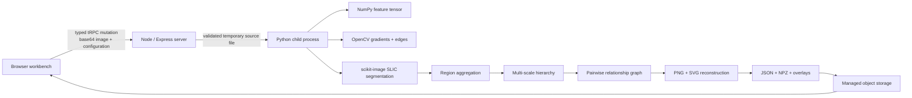

# System Architecture

The Node process owns upload validation, timeout enforcement, temporary-workspace cleanup, and artifact persistence. It creates one short-lived Python child process per accepted analysis request. Python writes only small JSON completion output to stdout and stores the generated artifacts in the allocated workspace. After successful completion, Node uploads artifacts to managed object storage and returns typed URLs to the workbench.

The engine is arranged as distinct stages—feature extraction, grouping, aggregation, hierarchy, relationships, reconstruction, and metrics. Its `GroupingStrategy` interface currently registers `slic`; a future deterministic or learned grouping method can be registered without changing the client-facing representation contract.
